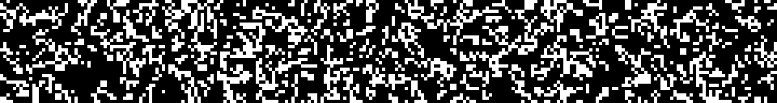

<div align="center">

# **Garca** - GitHub Actions (*Rusty!*) Cellular Automata 

<a href="https://github.com/paulo-granthon/garca"></a>


<a href="https://github.com/paulo-granthon/garca"></a>

This is a [Cellular Automata](https://en.wikipedia.org/wiki/Cellular_automaton) implementation in [Rust](https://www.rust-lang.org/) using [GitHub Actions](https://github.com/features/actions) to automatically update the state of the grid. The above image is the current state of the Cellular Automata environment.

</div>
</br>

# Cellular Automata
The Cellular Automata can be defined by a grid of ones and zeros with a simple set of rules that gets applied each iteration to generate a new grid based on the state of the previous. A cell is alive if it's value is **1** and dead if it's value is **0**. For each iteration of the program, each cell verifies it's surroundings to define it's new state:
- Cell is Alive (**1**):
  - It has less than **2** alive neighbours: Cell **dies** due to underpopulation.
  - It has exactly **2** or **3** alive neighbours: Cell **survives** to the next generation.
  - It has more than **3** alive neighbours: Cell **dies** due to overpopulation.
- Cell is dead (**0**):
  - It has exactly **3** alive neighbours: Cell **is born** due to reproduction.

</br>

# GitHub Actions:
I use GitHub Actions to automate the updating of the grid by configuring the repository to run the Rust code and upload the changes to this repository everyday.  

```yaml
on:
  schedule:
    - cron: "0 0 * * *"

```

<div align="center">

### Breaking down the cron expression "0 0 * * *":

</div>
</hr>

- The first field (0) represents the minute when the job will be executed. In this case, 0 means the job will be executed at the start of the hour (i.e., at 0 minutes past the hour).
- The second field (0) represents the hour when the job will be executed. In this case, 0 means the job will be executed at midnight (0th hour).
- The third field (\*) represents the day of the month. An asterisk (\*) in this position means the job will run every day of the month.
- The fourth field (\*) represents the month. An asterisk (\*) in this position means the job will run every month.
- The fifth field (\*) represents the day of the week. An asterisk (\*) in this position means the job will run every day of the week.

# ***todo!()***
- [ ] Animate it somehow
